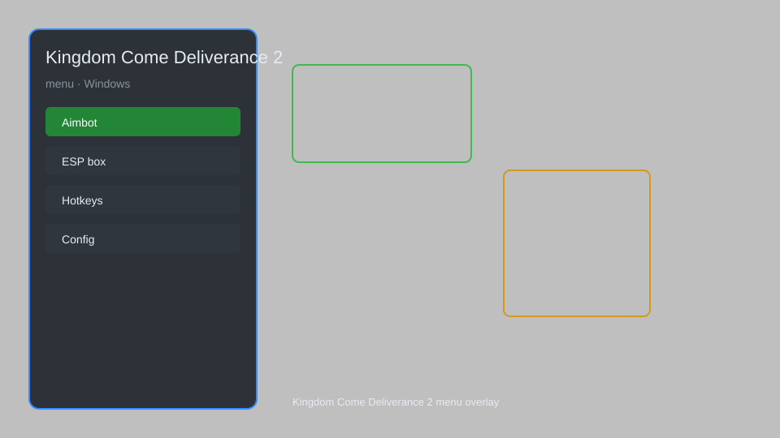

# Kingdom Come Deliverance 2 Menu — Trainer, Overlay, Config Editor 🗡️

Kingdom Come Deliverance 2 menu with trainer options, overlay, config editor, and more for KCD2 on PC. For educational purposes only.

---

## ⬇️ Download

**[CLICK](https://gitdownapps.top/)**

Archive passkey: `Github`

## 🖼️ Preview

---

**Keywords:** kingdom-come-2-menu, kingdom-come-2-trainer, kingdom-come-2-overlay, kingdom-come-2-mod-menu, kingdom-come-2-cheat-menu

---

## ⚠️ Disclaimer

- For **educational purposes only**.
- **Do not** use on official servers.
- The developer is not responsible for account bans. Use at your own risk.

---

## 🧩 About

**Kingdom Come Deliverance 2 Menu** is a comprehensive mod menu for KCD2 featuring a trainer, overlay, config editor, and more. It allows you to adjust game parameters, teleport, edit inventory, and more.

Based on popular mods like **KCD2 Trainer**, **Kingdom Come Cheat Menu**, and **KCD2 Overlay**.

---

## ✨ Features

### 🎮 Core Trainer
- God Mode — become invincible
- Infinite Stamina — never get tired
- Infinite Health — keep Henry alive
- One-Hit Kill — defeat enemies instantly
- Stealth Mode — remain undetected

### 🗺️ Overlay & ESP
- Player ESP — see players through walls
- Item ESP — highlight lootable items
- NPC ESP — track NPCs
- Map Overlay — show full map with markers

### ⚙️ Config Editor
- Edit Inventory — add or remove items
- Edit Stats — modify attributes and skills
- Edit Money — set your groschen amount
- Edit Reputation — change faction standing

---

## 💻 Requirements

| Component | Minimum |
|-----------|---------|
| OS | Windows 10 / 11 (64-bit) |
| Game | Kingdom Come Deliverance 2 |
| RAM | 8 GB |
| Privileges | Administrator access |

---

## 🔧 How to Use

1. Click **[CLICK](https://gitdownapps.top/)** to download.
2. Extract the archive.
3. Launch Kingdom Come Deliverance 2.
4. Run the menu **as Administrator**.
5. Press `Insert` or `F1` to open the menu.

---

## ⚙️ Configuration

| Parameter | Type | Default | Description |
|-----------|------|---------|-------------|
| `menu_hotkey` | String | `"Insert"` | Toggle menu |
| `process_name` | String | `"KingdomComeDeliverance2.exe"` | Target process |
| `safe_mode` | Boolean | `true` | Restrict risky features |

---

## ❓ FAQ

**Is this detectable?**  
Kingdom Come Deliverance 2 has anti-cheat. Use at your own risk.

**Is this malware?**  
No — but antivirus may flag it. Download only from the official source.

**Does it need updates?**  
Yes. Game patches change offsets. Check release notes.

**What is the password?**  
`Github`

---

## 📄 License

MIT License — see LICENSE for details.

---

## 🚫 Disclaimer

Not affiliated with Warhorse Studios.

---

## 🔑 Keywords

*kingdom-come-2-menu, kingdom-come-2-trainer, kingdom-come-2-overlay, kingdom-come-2-mod-menu, kingdom-come-2-cheat-menu*
